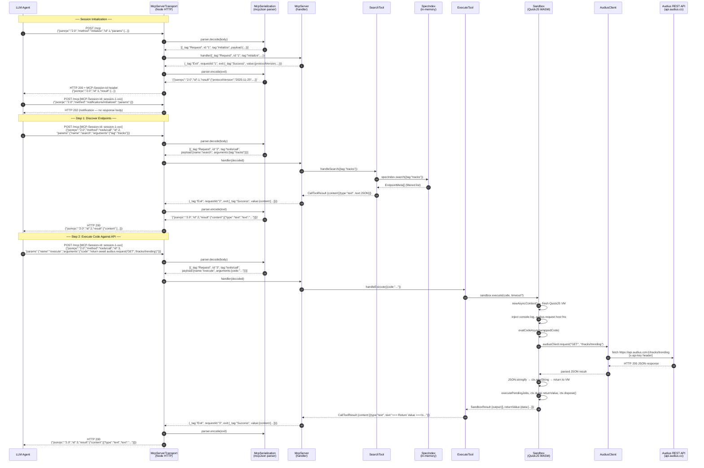
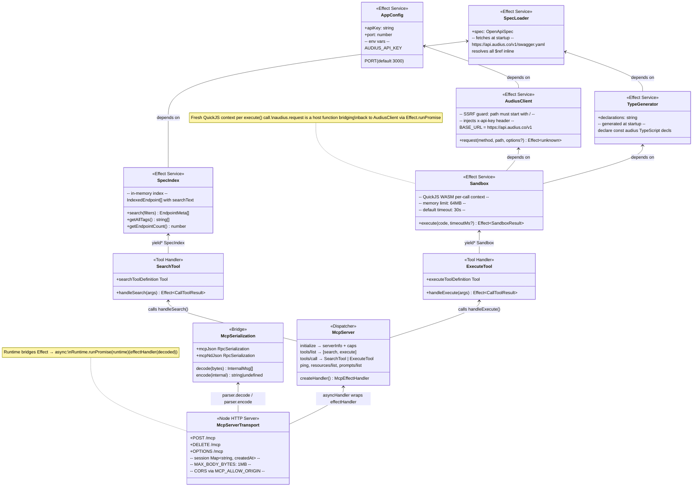
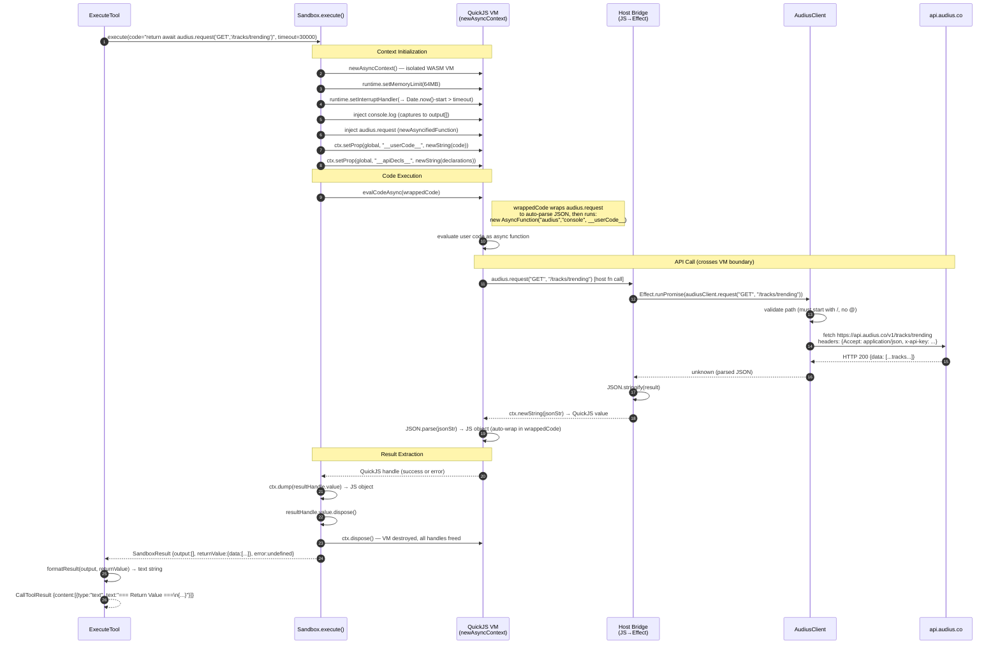
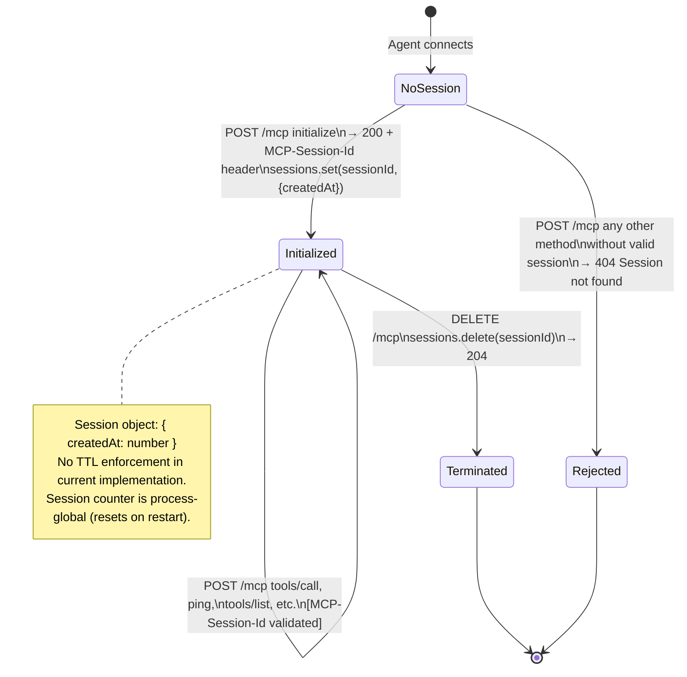
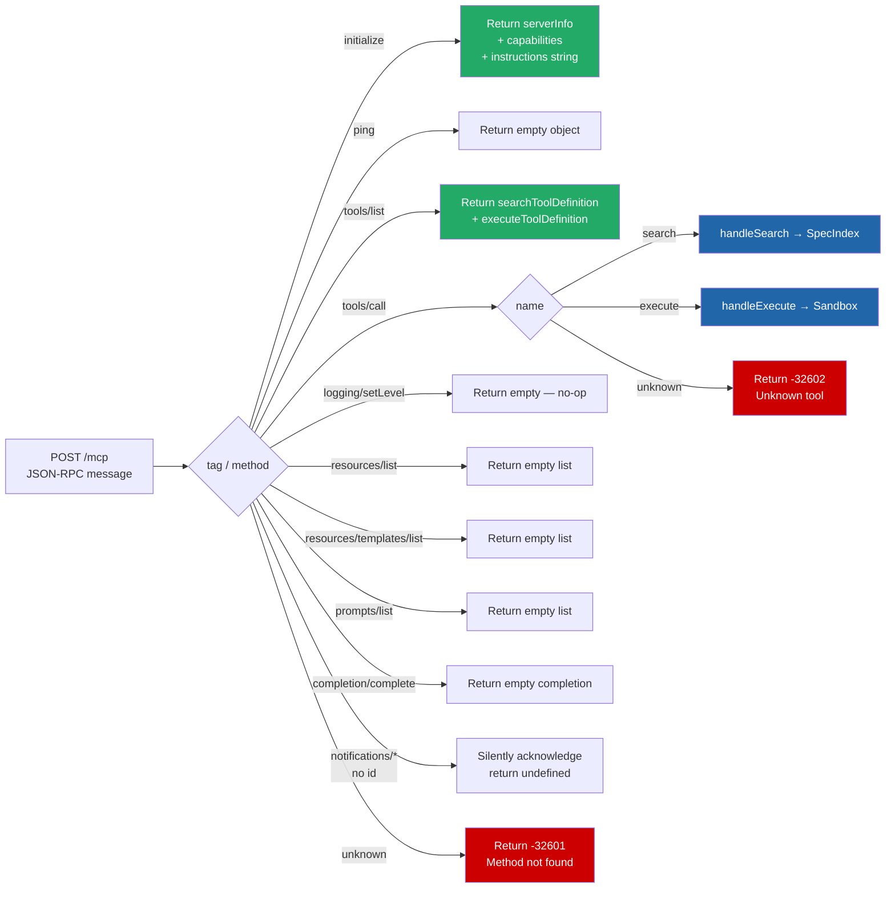

# Audius MCP Server — Agent Data Flow Architecture

The Audius MCP server is a **Code Mode** MCP server: instead of exposing hundreds of individual tools, it gives LLM agents two tools — `search` (to discover API endpoints from the bundled OpenAPI spec) and `execute` (to run JavaScript against the Audius REST API inside a QuickJS WASM sandbox). All traffic arrives over Streamable HTTP at `POST /mcp` using the MCP 2025-11-25 protocol.

## Key Files

| File | Role |
|------|------|
| `src/index.ts` | Entry point — Effect layer composition, HTTP server startup |
| `src/AppConfig.ts` | Effect Config service — reads `AUDIUS_API_KEY` and `PORT` env vars |
| `src/mcp/McpServerTransport.ts` | HTTP server, session management, body parsing, CORS |
| `src/mcp/McpSerialization.ts` | Bidirectional JSON-RPC 2.0 ↔ internal Effect RPC message bridge |
| `src/mcp/McpServer.ts` | Method dispatcher (`initialize`, `tools/list`, `tools/call`, etc.) |
| `src/mcp/McpSchema.ts` | Full MCP 2025-11-25 spec ported to Effect Schema + `@effect/rpc` |
| `src/mcp/McpNotifications.ts` | Inbound/outbound notification dispatcher (not wired in current server path) |
| `src/tools/SearchTool.ts` | `search` tool — queries `SpecIndex` |
| `src/tools/ExecuteTool.ts` | `execute` tool — delegates to `Sandbox` |
| `src/api/SpecLoader.ts` | Fetches `swagger.yaml` from `api.audius.co`, resolves `$ref` |
| `src/api/SpecIndex.ts` | Builds searchable in-memory index from resolved spec |
| `src/api/AudiusClient.ts` | Thin fetch wrapper — injects API key, validates paths against SSRF |
| `src/sandbox/Sandbox.ts` | QuickJS WASM context: injects `audius.request`, `console.log`, timeout/memory limits |
| `src/sandbox/TypeGenerator.ts` | Generates compact TS declaration string from spec for LLM context |

---

## Diagram 1 — Full Agent Interaction Sequence

This diagram traces the complete round trip for a typical two-step agent session: the agent first calls `search` to discover endpoints, then calls `execute` to run code against the API. Each step shows the exact message format at every layer boundary.



### Wire Format Details

The serialization bridge (`McpSerialization.ts`) performs two translations on every request/response cycle:

**Inbound (JSON-RPC → internal):**
```json
// Wire: JSON-RPC 2.0
{"jsonrpc":"2.0","method":"tools/call","id":3,"params":{"name":"execute","arguments":{"code":"..."}}}

// Internal: Effect RPC message
{"_tag":"Request","id":"3","tag":"tools/call","payload":{"name":"execute","arguments":{"code":"..."}},"headers":[]}
```

**Outbound (internal → JSON-RPC):**
```json
// Internal: Effect Exit value
{"_tag":"Exit","requestId":"3","exit":{"_tag":"Success","value":{"content":[{"type":"text","text":"..."}]}}}

// Wire: JSON-RPC 2.0
{"jsonrpc":"2.0","id":3,"result":{"content":[{"type":"text","text":"..."}]}}
```

Note that numeric IDs are preserved as numbers (`id: 3` not `"3"`) — the bridge uses `toWireId()` which round-trips the string back to a number only when `String(Number(id)) === id`.

---

## Diagram 2 — Component Architecture

This diagram shows every Effect service (`Context.Tag`), its dependencies, and how all components are composed into the application layer in `src/index.ts`.



### Layer Composition Order

`src/index.ts` builds the dependency graph bottom-up:

```
AppConfigLive
  └── AudiusClientLayer
        └── SandboxLayer ←── TypeGeneratorLayer ←── SpecLoaderLayer
                                                         └── SpecIndexLayer

AppLayer = merge(AppConfigLive, SpecIndexLayer, SandboxLayer)
```

The `Runtime<SpecIndex | Sandbox>` is materialized once at startup and reused for every HTTP request, so services are not re-initialized per call.

---

## Diagram 3 — Execute Tool Sandbox Data Flow

This diagram zooms into the `execute` tool's sandbox, showing the exact data transformations as user code flows into the QuickJS VM and results flow back out. This is the most complex data path in the system.



### Isolation Invariants

Three mechanisms enforce sandboxed execution:

1. **Memory cap** — `runtime.setMemoryLimit(64MB)`. If user code allocates past this, the VM throws before reaching the host.
2. **Interrupt handler** — checked on every VM tick. If `Date.now() - startTime > timeout`, QuickJS throws an "interrupted" exception into the running code.
3. **Fresh context per call** — `newAsyncContext()` is called at the top of each `execute()` invocation and `ctx.dispose()` is called in the `finally` block. No state survives between calls.

The host function (`audius.request`) crosses the WASM boundary via `newAsyncifiedFunction`. The result is round-tripped through JSON (`JSON.stringify → ctx.newString → JSON.parse`) because there is no direct complex-object bridge between the WASM heap and the Node.js heap — only primitive QuickJS handles can cross the boundary cheaply.

User code is stored in `__userCode__` as a string rather than interpolated into `wrappedCode` directly, preventing template-literal injection attacks where an API spec summary containing a backtick could escape the template string context.

---

## Diagram 4 — Startup / Initialization Lifecycle

This diagram shows the order of Effect layer initialization from `SIGINT`/`SIGTERM` to the server being ready to accept requests.

```mermaid
flowchart TD
    A([process.start]) --> B[Effect.runFork: program]
    B --> C{provide AppLayer}

    C --> D[AppConfigLive\nreads env vars synchronously]
    C --> E[SpecLoaderLive\nfetch swagger.yaml]
    C --> F[AudiusClientLive\nreads AppConfig]

    E --> G{YAML parse +\nresolve all $ref}
    G -->|success| H[SpecLoaderLive ready\nspec: OpenApiSpec]
    G -->|failure| ERR1([Effect.fail: Error\nprocess exits])

    H --> I[SpecIndexLive\nbuildIndex over spec.paths]
    H --> J[TypeGeneratorLive\ngenerateDeclarations from spec]

    I --> K[SpecIndexLive ready\nN endpoints, M tags]
    J --> L[TypeGeneratorLive ready\ndeclarations: string]

    F --> M[AudiusClientLive ready\nrequest() closure with apiKey]

    M --> N[SandboxLive\nacquires AudiusClient + TypeGenerator]
    L --> N
    N --> O[SandboxLive ready\nexecute() closure]

    D --> P[program: AppConfig yields port]
    K --> P
    O --> P

    P --> Q[createHandler\nMcpEffectHandler closure]
    Q --> R[Effect.runtime — materializes\nRuntime for SpecIndex + Sandbox]
    R --> S[asyncHandler bridge\nRuntime.runPromise wraps effectHandler]
    S --> T[startServer acquireRelease\nHttp.createServer + listen on PORT]

    T --> U([Server ready\nPOST /mcp accepting requests])

    U --> V{SIGINT / SIGTERM}
    V --> W[Fiber.interrupt]
    W --> X[acquireRelease cleanup:\nserver.close]
    X --> Y([Process exits cleanly])

    style ERR1 fill:#c00,color:#fff
    style A fill:#090,color:#fff
    style U fill:#090,color:#fff
    style Y fill:#555,color:#fff
```

### Startup Dependency Constraints

Two paths run in parallel once `SpecLoaderLive` completes:

- `SpecLoader → SpecIndex` — builds the search index (CPU-bound, proportional to number of paths in the spec)
- `SpecLoader → TypeGenerator` — generates TypeScript declarations (CPU-bound, also proportional to spec size)

`SandboxLive` blocks until both `AudiusClientLive` (fast — synchronous) and `TypeGeneratorLive` (depends on SpecLoader) are ready.

The `Effect.runtime<SpecIndex | Sandbox>()` call in `program` captures a pre-built runtime that includes all required services. This is the bridge from the Effect world to the `async`/`await` world of the Node.js HTTP handler — it is materialized once and reused for the entire server lifetime.

If `SpecLoaderLive` fails (network unreachable, non-200 response), `Effect.runFork` propagates the defect and the process exits before the HTTP server starts.

---

## Diagram 5 — Session Lifecycle State Machine

The transport layer maintains a simple session registry (`Map<string, {createdAt: number}>`). This diagram shows how session state transitions on each request.



### Session ID Format

Session IDs are generated as `session-${++counter}-${Date.now().toString(36)}`. The counter is a module-level `let sessionCounter = 0` — it is not shared across process restarts or multiple server instances. The `Date.now().toString(36)` suffix adds base-36 timestamp entropy to reduce collision probability.

---

## Diagram 6 — MCP Protocol Message Taxonomy

This diagram shows all MCP methods the server handles and their response strategies, as implemented in `McpServer.ts`.



The server declares `capabilities: { tools: {} }` in the `initialize` response, signalling that it supports the tools capability but not resources, prompts, logging, or sampling. Requests for those capabilities are handled gracefully (empty lists) rather than returning method-not-found errors, which ensures compatibility with MCP clients that enumerate capabilities before use.
